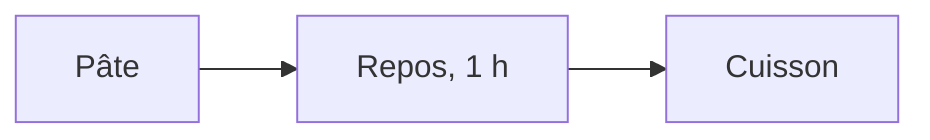

Cette partie présente les fichiers texte d'un projet autres que le code, puis
Markdown, le format dans lequel s'écrit sa documentation. Elle décrit ensuite
le notebook, un document qui réunit du texte écrit en Markdown, du code et les
résultats de ce code, et la façon de l'ouvrir dans JupyterLab. Deux TD
l'accompagnent, le [TD 3a](td/3a_markdown/guide.md) et le
[TD 3b](td/3b_notebooks/guide.md) ; ils sont présentés en fin de page.

## Les fichiers texte d'un projet

Un projet ne contient pas seulement du code. Ses réglages et sa documentation
sont aussi des fichiers texte, qui s'ouvrent dans le même éditeur que le code,
se comparent ligne à ligne et se versionnent de la même façon. Sur un projet
réel, ces fichiers sont souvent plus nombreux que les fichiers de programme.

```{list-table}
:header-rows: 1

* - Fichier
  - Ce qu'il contient
  - Qui le lit
* - `.py`
  - les instructions du programme
  - l'interpréteur
* - `.md`
  - la documentation, les notes, le `README`
  - un humain
* - `.toml`, `.yml`
  - les réglages du projet et la liste de ses dépendances
  - un outil
* - `.csv`
  - un petit jeu d'essai, pour vérifier que le programme fonctionne
  - un programme
```

Le `README.md` est le fichier que l'on ouvre en premier dans un projet : il
dit ce que fait le projet et comment le lancer. La suite de la partie porte
sur le format `.md` dans lequel il s'écrit ; les fichiers `.toml` et `.yml`
sont traités à la partie 4.

:::{warning}
Les données de travail ne font pas partie des fichiers du projet. Elles sont
stockées dans un autre dossier, et le programme les lit par un chemin de
fichier. Le projet ne contient qu'un petit jeu de données, de quelques lignes,
qui sert à le tester. Un relevé de plusieurs centaines de mégaoctets, une
image ou un classeur `.xlsx` placés dans un dépôt versionné (cours 2) ne se
comparent pas ligne à ligne, et alourdissent définitivement l'historique du
dépôt.
:::

## Le format de la documentation

Un fichier `.txt` ne porte aucune mise en forme : ni titre, ni liste, ni
emphase. Un document `.odt` ou `.docx` en porte une, mais c'est un fichier
binaire, qui ne se compare pas ligne à ligne et ne s'ouvre pas dans l'éditeur
de code. **Markdown** est un format intermédiaire : un fichier texte dans
lequel quelques signes indiquent la mise en forme. L'éditeur affiche, dans un
aperçu, le document mis en forme.

```{figure} figures/3_readme.svg
:alt: À gauche, le fichier README.md tel qu'il est écrit : une ligne où « Trajet » suit un dièse, la phrase « Trace le trajet de la gare à l'école. », une ligne où « Lancer » suit deux dièses, la commande « python trajet.py » précédée de quatre espaces, et la phrase « Le résultat est *trajet.png*. ». À droite, l'aperçu du même fichier : « Trajet » en grand titre, la phrase, « Lancer » en sous-titre, la commande dans un bloc grisé en police à chasse fixe, et « trajet.png » en italique.

Le même `README.md`, tel qu'il est écrit et tel que l'aperçu l'affiche.
```

Markdown offre moins de possibilités de mise en page qu'un traitement de
texte. Il permet en échange d'écrire la documentation dans l'éditeur de code,
de la comparer ligne à ligne, de la versionner, et de la convertir dans un
autre format quand il le faut. Le tableau compare les trois façons d'écrire un
document.

```{list-table}
:header-rows: 1

* -
  - `.txt`
  - `.md`
  - `.odt`, `.docx`
* - Titres, listes, emphase
  - aucun
  - marqués par des signes dans le texte
  - enregistrés dans des balises XML
* - Lisible sans logiciel dédié
  - oui
  - oui
  - non
* - Comparaison ligne à ligne
  - oui
  - oui
  - non
* - Mise en page fine
  - non
  - non
  - oui
* - Usage
  - note rapide, sortie d'un programme, relevé
  - `README`, notes, documentation d'un projet
  - rapport à rendre, charte graphique imposée
```

Un rapport à rendre en PDF peut être écrit en Markdown : le programme `pandoc`
produit un PDF à partir d'un fichier `.md`. L'auteur perd le contrôle fin de
la mise en page, et garde un fichier source qu'il peut relire, comparer et
versionner. Le format `.txt` reste celui des sorties de programme et des
relevés, où une structure de titres et de listes n'aurait pas d'usage.

## L'intention de Markdown

John Gruber publie Markdown en mars 2004, sur son site *Daring Fireball*,
avec Aaron Swartz pour seul testeur ; la notation des titres par `#` vient
d'atx, un format de Swartz. Gruber énonce ainsi le but de Markdown : un format
de texte facile à lire et à écrire, convertible en HTML, et dont un document
peut être publié tel quel, en texte brut, sans avoir l'air balisé. Sa source
d'inspiration principale est le courriel en texte brut.

Le même contenu s'écrit ainsi en Markdown et en HTML :

::::{grid} 1 1 2 2

:::{grid-item}
```markdown
# Crêpes

*1 heure de repos.*

1. Mélanger la farine
2. Casser les **œufs**
```
:::

:::{grid-item}
```html
<h1>Crêpes</h1>
<p><em>1 heure de repos.</em></p>
<ol><li>Mélanger la farine</li>
<li>Casser les <strong>œufs</strong>
</li></ol>
```
:::

::::

Une fois converti en HTML, le fichier Markdown s'affiche dans un navigateur
comme le fichier HTML ; avant conversion, il est le seul des deux qui se lise
facilement. La contrainte de départ de
Markdown est que la source reste lisible sans conversion ; ses limites, comme
l'absence de mise en page fine, découlent de cette contrainte.

:::{note}
La description de Gruber laissait des cas ambigus, que les outils de
conversion interprétaient de façons différentes. Depuis 2014, la
spécification CommonMark fixe la syntaxe de Markdown et fournit une suite de
tests. Un même fichier peut encore s'afficher un peu différemment d'un outil
à l'autre, quand l'un d'eux est antérieur à CommonMark ou ajoute ses propres
extensions.
:::

## La syntaxe de Markdown

Une dizaine de marques suffisent pour écrire un document, et chacune se
comprend sans que le texte soit rendu : le dièse annonce un titre, le tiret
une puce, les astérisques une emphase.

```{figure} figures/3_syntaxe.svg
:alt: À gauche, le texte Markdown : « Un titre » précédé d'un dièse, « Un sous-titre » précédé de deux dièses, une phrase avec « *emphase* » et « **gras** », une ligne « - une puce », une ligne « 1. une étape », un lien « [un lien](https://typst.app) » et une image «  ». À droite, l'affichage : un titre, un sous-titre plus petit, la phrase avec « emphase » en italique et « gras » en gras, une puce, une étape numérotée, un lien souligné et l'emplacement d'une photo.

Les marques courantes de Markdown, et leur affichage.
```

La syntaxe complète est décrite par Gruber sur
[daringfireball.net/projects/markdown/syntax](https://daringfireball.net/projects/markdown/syntax).
Deux marques absentes du schéma servent au TD 3a. Un **tableau** s'écrit avec
des barres verticales entre les colonnes, et une ligne de tirets sous la ligne
d'en-tête ; l'alignement des barres d'une ligne à l'autre n'est pas
obligatoire. Un **bloc de code** s'écrit entre deux lignes de trois accents
graves ; le nom du langage, écrit juste après les trois premiers accents
graves, permet à l'aperçu de colorer le code.

```markdown
| Ingrédient | Quantité |
|---|---|
| farine | 250 g |
| œufs | 4 |
```

Un lien et une image s'écrivent de la même façon, avec un point
d'exclamation devant l'image. L'image n'est pas enregistrée dans le fichier
`.md` : elle y est désignée par son chemin, relatif au dossier du fichier
`.md`, et elle reste un fichier séparé. `` suppose
ainsi que `poele.jpg` se trouve dans le même dossier que le document. Les
chemins relatifs sont ceux de la partie 1.

:::{warning}
Deux erreurs de syntaxe sont fréquentes. Une ligne vide sépare deux
paragraphes : deux lignes consécutives sans ligne vide entre elles forment un
seul paragraphe dans l'aperçu. Le dièse d'un titre est suivi d'une espace :
`#Titre` s'affiche comme du texte ordinaire, et non comme un titre.
:::

Un bloc de code dont le langage est `mermaid` décrit un diagramme en texte,
que l'aperçu de l'éditeur dessine sous forme de boîtes et de flèches. Le bloc
suivant décrit trois boîtes, « Pâte », « Repos, 1 h » et « Cuisson », reliées
par deux flèches :

````text

````

Le fichier ne contient que ces lignes, et le dessin est calculé à
l'affichage, comme la coloration du code. Un diagramme ainsi écrit se compare
ligne à ligne, se versionne et se corrige sans logiciel de dessin. La syntaxe
est décrite sur
[mermaid.js.org/syntax/flowchart.html](https://mermaid.js.org/syntax/flowchart.html).

L'éditeur de code prend en charge Markdown sans extension à installer.
`Ctrl` + `K` puis `V` ouvre l'aperçu à côté du fichier, et le met à jour
pendant la frappe ; `Ctrl` + `Maj` + `V` ouvre l'aperçu seul, dans un onglet.
L'aperçu ne modifie pas le fichier : ce qui est enregistré reste le texte
tapé.

## Programmation littérale

Dans un projet, le code est d'ordinaire dans un fichier, son explication dans
un autre, et son résultat n'est enregistré nulle part. Un **notebook**, ou
carnet, réunit les trois dans un seul document, dans l'ordre du raisonnement :
des blocs de texte, des blocs de code, et sous chaque bloc de code le
résultat de son exécution.

```{figure} figures/3_notebook.svg
:alt: Un document nommé trajet.ipynb, fait de blocs empilés. En haut, un bloc de texte, étiqueté « texte », avec le titre « Longueur du trajet » et deux lignes de texte. Dessous, un bloc étiqueté « code », numéroté [1], qui contient trois lignes Python : import numpy as np, points = np.loadtxt("trajet.csv"), print(points.shape). Dessous, un bloc étiqueté « résultat », numéroté [1], qui affiche (128, 2). En bas, un bloc en pointillé indique que le document continue.

Les trois sortes de blocs d'un notebook, dans l'ordre où ils sont écrits.
```

L'idée d'écrire un programme comme un texte explicatif, dans lequel le code
s'insère à l'endroit où il est expliqué, est due à Donald Knuth, qui l'a nommée **programmation littérale**
(*literate programming*) en 1984. Knuth propose de considérer les programmes comme des œuvres de
littérature, écrites pour être lues par des humains autant que pour être
exécutées par une machine.

Le résultat de chaque bloc de code est enregistré dans le fichier du
notebook. Rouvert le lendemain, le notebook affiche encore ce que le code a
produit la veille, sans avoir été exécuté de nouveau : un notebook se lit
ainsi sans l'exécuter. Le fichier `.ipynb` est un fichier texte au format
JSON, dans lequel chaque cellule porte son code, son numéro d'exécution et
ses résultats. La cellule suivante construit le contenu d'un notebook d'une
seule cellule, et l'affiche au format JSON :

```{code-cell} python
import json

notebook = {
    "cells": [
        {"cell_type": "code",
         "execution_count": 1,
         "metadata": {},
         "source": ["print('bonjour')"],
         "outputs": [{"output_type": "stream", "name": "stdout",
                      "text": ["bonjour\n"]}]},
    ],
    "metadata": {"kernelspec": {"name": "python3"}},
    "nbformat": 4, "nbformat_minor": 5,
}

print(json.dumps(notebook, indent=1))
```

Ce fichier est produit par l'application qui affiche le notebook, et n'est
pas destiné à être modifié à la main. Les résultats enregistrés, y compris
les images, codées en texte, rendent un `.ipynb` lourd,
et deux exécutions du même notebook produisent des fichiers qui diffèrent sur
de nombreuses lignes, alors que le code n'a pas changé. Un `.ipynb` se
versionne donc mal.

:::{note}
Un notebook peut aussi s'écrire en MyST Markdown : les blocs de texte sont du
Markdown, les cellules de code des blocs ` ```{code-cell} `, et les résultats
sont recalculés à chaque construction au lieu d'être enregistrés. Le fichier
reste lisible et se compare ligne à ligne. Cette page est écrite dans ce
format, et la sortie de la cellule précédente a été calculée à la
construction du site.
:::

Le notebook sert à explorer des données et à expliquer une démarche. Il ne
convient pas pour livrer un outil qui doit s'exécuter seul, du début à la
fin : le code d'un tel outil s'écrit dans un script `.py`, sujet du
cours 3. Le tableau situe le notebook parmi les façons d'exécuter du Python vues depuis le TD 2a.

```{list-table}
:header-rows: 1

* - Forme
  - Usage
  - Limite
* - Interpréteur interactif (`python`)
  - essayer une ligne, faire un calcul
  - rien n'est conservé
* - Script (`.py`)
  - un programme que l'on relance et que l'on versionne
  - les résultats intermédiaires ne sont pas affichés
* - Notebook (`.ipynb`)
  - explorer, documenter, présenter un résultat
  - fichier lourd, difficile à versionner
```

## Le bloc de texte d'un notebook

Le bloc de texte d'un notebook s'écrit en Markdown, avec la même syntaxe que
le `README.md` et le fichier du TD 3a. Le bloc suivant, par exemple :

```markdown
# Longueur d'un trajet

Les points du trajet sont donnés en
**coordonnées projetées**, en mètres.
```

s'affiche avec le titre « Longueur d'un trajet » en grand, et les mots
« coordonnées projetées » en gras. Un bloc de texte a deux états : `Maj` +
`Entrée` affiche le texte mis en forme, et un double clic sur le bloc revient
au texte source. Cette alternance est celle de l'aperçu Markdown de
l'éditeur.

Un bloc de texte n'est transmis à aucun programme pour être exécuté :
l'application se contente de le mettre en forme. Pour cette raison, seuls les
blocs de code portent un numéro d'exécution, comme `[1]`.

## Un notebook dans JupyterLab

**JupyterLab** est une application qui affiche et exécute des notebooks dans
un onglet du navigateur. Sa fenêtre présente les trois sortes de blocs du
schéma de la programmation littérale, dans l'ordre : le titre et le texte en
haut, la cellule de code et son numéro, le résultat juste en dessous, puis le texte qui commente
ce résultat. À gauche de la fenêtre, l'arborescence des fichiers montre le
notebook à sa place dans son dossier, parmi les autres fichiers.

Le numéro entre crochets, `[1]`, est le rang d'exécution de la cellule, et
non sa place dans le document. Une cellule exécutée une seconde fois prend le
numéro suivant, `[2]` par exemple. Des numéros qui ne se suivent pas du haut
vers le bas du document indiquent que les cellules ont été exécutées dans le
désordre.

:::{warning}
Les cellules d'un notebook peuvent être exécutées dans n'importe quel ordre,
et une cellule modifiée mais non exécutée n'a aucun effet. Un notebook qui
donne le bon résultat sur le poste de son auteur peut ainsi en donner un autre
quand il est exécuté du début à la fin sur un autre poste. Un notebook se
partage après avoir été exécuté entièrement, depuis le début, ce que fait
dans JupyterLab la commande *Restart Kernel and Run All Cells* du menu
*Kernel*.
:::

En haut à droite, JupyterLab affiche le nom du **noyau**, par exemple
`Python 3 (ipykernel)` : le programme qui exécute les cellules de code et
conserve leurs variables d'une cellule à l'autre. Le noyau se choisit à
l'ouverture du notebook ; ce choix est traité à la partie 4.

## Lancer JupyterLab depuis Anaconda

JupyterLab est livré avec la distribution Anaconda. Il se lance depuis la
page d'accueil d'Anaconda Navigator, par le bouton *Launch* de sa fiche,
comme l'éditeur de code au TD 2a. Le numéro affiché sous le nom de
l'application est la version installée. La commande `jupyter lab`, tapée dans
un terminal où l'environnement `base` d'Anaconda est actif, lance la même
application.

Le bouton de la fiche indique *Launch*, et non *Install*, parce que la
distribution Anaconda installe JupyterLab et `ipykernel` dans son
environnement `base`. Une installation de Miniconda ou de Miniforge part d'un
environnement `base` minimal, sans JupyterLab : la fiche indique alors
*Install*.

JupyterLab s'ouvre dans un onglet du navigateur, sur une adresse de la forme
`http://localhost:8888/lab` : la page affichée et le programme qui l'envoie au navigateur
sont tous deux sur l'ordinateur de l'utilisateur. La partie 4 explique cette
organisation en client et serveur.

## TD de la partie

- [TD 3a — Mettre en forme une recette en Markdown](td/3a_markdown/guide.md),
  20 minutes : reprendre en Markdown un texte brut sans structure, avec
  l'aperçu ouvert à côté, pour décider ce qui est un titre, une étape ou une
  donnée.
- [TD 3b — Le notebook, ouvert de trois façons](td/3b_notebooks/guide.md),
  12 minutes : ouvrir le même notebook dans le navigateur, dans l'éditeur et
  dans JupyterLab, et constater ce que le noyau retient d'une cellule à
  l'autre.

Les TD des autres parties sont dans [Travaux dirigés de la
séance 1](travaux_diriges.md).
