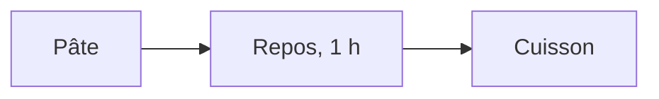

Le TD part d'un texte brut, une recette de crêpes écrite sans aucune
structure : ni titre, ni liste, ni tableau. On le réécrit en Markdown dans
l'éditeur de code, VS Code, avec l'aperçu ouvert à côté, en décidant ce qui
est un titre, ce qui est une étape et ce qui est une donnée. On y ajoute un
tableau, une photo et un diagramme écrit en texte. Le TD dure une vingtaine
de minutes.

Tout se fait dans VS Code, configuré au TD 2a. L'aperçu Markdown et le rendu
des diagrammes sont livrés avec l'éditeur : il n'y a rien à installer.

| Étape | Ce qu'on fait |
|---|---|
| 1 | ouvrir le dossier, créer `recette.md` et ouvrir l'aperçu |
| 2 | poser les titres et la liste des étapes |
| 3 | écrire le tableau des ingrédients |
| 4 | afficher la photo |
| 5 | dessiner l'ordre des opérations, et comparer au résultat attendu |

Ce que chaque étape fait constater est expliqué à la fin du guide, dans « Ce
que le TD fait constater » : faire l'étape d'abord, et noter ce qu'on
observe, avant de lire l'explication.

Le dossier du TD sert aussi à un second TD, facultatif et fait seul, qui
compare deux versions de la recette pour préparer le cours 2 ; il a sa propre
page sur le site du cours, et ce guide ne le traite pas.

## 1 · Ouvrir le dossier, créer `recette.md` et ouvrir l'aperçu

> **À faire :** ouvrir `cours1\3a_markdown\` dans VS Code ; enregistrer
> `depart\recette_a_formater.txt` sous `travail\recette.md` ; ouvrir
> l'aperçu à côté.
>
> **À obtenir :** `recette.md` ouvert à gauche, son aperçu à droite.

### Le dossier du TD

Le dossier `info01\cours1\3a_markdown\` contient :

```text
3a_markdown\
├── depart\
│   ├── recette_a_formater.txt   le texte de départ, sans aucune structure
│   ├── ingredients.csv          les ingrédients, à transformer en tableau
│   ├── crepes.jpg               la photo de la recette
│   ├── recette.md               le résultat attendu, à n'ouvrir qu'à la fin
│   └── comparer.py              sert au TD facultatif de comparaison
├── travail\                     vide
├── td_3a_markdown.pdf           la feuille du TD
└── README.md
```

Comme aux TD précédents, `depart\` contient les fichiers fournis et ne se
modifie pas ; les fichiers écrits pendant le TD sont enregistrés dans
`travail\`.

### Ouvrir le dossier dans VS Code

Lancer VS Code (fiche VS Code d'Anaconda Navigator, ou menu Démarrer), puis
menu File, Open Folder (Fichier, Ouvrir le dossier), et choisir
`Bureau\info01\cours1\3a_markdown`. Le panneau Explorer, à gauche, montre
`depart` et `travail`. Si VS Code demande si l'on fait confiance aux auteurs
du dossier, répondre « Yes, I trust the authors ».

### Enregistrer le texte sous un autre nom

1. Dans le panneau Explorer, ouvrir `depart`, puis cliquer sur
   `recette_a_formater.txt`. Le texte s'ouvre : vingt lignes, sans marque
   de mise en forme.
2. Menu File, Save As… (`Ctrl` + `Maj` + `S`). Dans la fenêtre, remonter
   d'un dossier, ouvrir `travail`, et taper le nom `recette.md`, avec son
   extension. Enregistrer.

L'onglet porte maintenant le nom `recette.md`, et le fichier apparaît sous
`travail` dans le panneau Explorer. `depart\recette_a_formater.txt` n'a pas
changé.

**Vérification** : en bas à droite de la fenêtre, la barre d'état indique le
langage du fichier, « Markdown ». Si elle indique « Plain Text », le fichier
a gardé l'extension `.txt` : recommencer l'enregistrement en tapant bien
`.md` à la fin du nom.

Le texte de départ est écrit sans accents. Le TD ne demande pas de les
rétablir ; le résultat attendu, `depart\recette.md`, les contient.

### Ouvrir l'aperçu

Cliquer dans `recette.md`, puis taper `Ctrl` + `K`, relâcher, et taper `V`.
L'aperçu s'ouvre à droite, et l'éditeur reste à gauche.

| L'action | Ce qu'elle ouvre | Quand s'en servir |
|---|---|---|
| `Ctrl` + `K` puis `V` | l'aperçu à droite, l'éditeur reste à gauche | pendant qu'on écrit : l'aperçu se met à jour pendant la frappe |
| `Ctrl` + `Maj` + `V` | l'aperçu seul, dans un onglet | pour relire, une fois le texte écrit |

Les deux commandes existent aussi dans la palette (`Ctrl` + `Maj` + `P`),
sous les noms « Markdown: Open Preview to the Side » et « Markdown: Open
Preview ». Elles ne fonctionnent que dans un fichier dont le langage est
Markdown : dans le `.txt` de départ, le raccourci ne fait rien.

**À noter** : comment l'aperçu affiche les lignes des ingrédients, avant
toute mise en forme.

## 2 · Poser les titres et la liste des étapes

> **À faire :** un titre en `#`, deux sous-titres en `##` ; les étapes de
> préparation en liste numérotée.
>
> **À obtenir :** dans l'aperçu, un grand titre, deux sous-titres et six
> étapes numérotées.

### Les titres

Le texte a un titre, la ligne `Crepes`, et deux parties, `Ingredients` et
`Preparation`. Un titre s'écrit en commençant la ligne par `#`, suivi d'un
espace ; un sous-titre par `##` :

```markdown
# Crêpes

Pour 12 crêpes, 10 minutes de préparation, 1 heure de repos.

## Ingrédients
```

L'espace après le dièse est obligatoire : `#Crepes` reste un paragraphe
ordinaire. Regarder l'aperçu après chaque ligne modifiée.

### La liste des étapes

Les six lignes qui suivent `Preparation` sont les étapes. Une liste numérotée
s'écrit en commençant chaque ligne par un nombre, un point et un espace :

```markdown
## Préparation

1. Mélanger la farine et le sel dans un saladier.
2. Casser les œufs au centre et mélanger.
```

Laisser une ligne vide entre le sous-titre et la liste, comme entre deux
paragraphes. Une ligne qui suit une autre sans ligne vide est rattachée au
même paragraphe.

**À noter** : ce que devient l'aperçu si l'on numérote toutes les étapes
`1.`, au lieu de `1.`, `2.`, `3.`…

## 3 · Écrire le tableau des ingrédients

> **À faire :** remplacer les cinq lignes d'ingrédients par un tableau à
> deux colonnes, à partir de `depart\ingredients.csv`.
>
> **À obtenir :** dans l'aperçu, un tableau « Ingrédient », « Quantité » de
> cinq lignes.

### Le fichier CSV

Ouvrir `depart\ingredients.csv` dans VS Code (clic dans le panneau
Explorer). Il contient six lignes, un en-tête puis un ingrédient par ligne,
les deux colonnes séparées par une virgule :

```text
Ingrédient,Quantité
Farine,250 g
Œufs,4
Lait,500 ml
Sel,1 pincée
Beurre fondu,50 g
```

### Le tableau Markdown

Un tableau Markdown est fait de lignes dont les cellules sont séparées par
des barres verticales, `|` (`AltGr` + `6` sur un clavier français). La
deuxième ligne, faite de tirets, sépare l'en-tête du reste :

```markdown
| Ingrédient | Quantité |
|---|---|
| Farine | 250 g |
| Œufs | 4 |
```

1. Copier les six lignes du CSV (`Ctrl` + `A`, `Ctrl` + `C`), et les coller
   dans `recette.md` à la place des lignes d'ingrédients.
2. Sur chaque ligne, remplacer la virgule par ` | `, et ajouter une barre au
   début et à la fin.
3. Insérer la ligne `|---|---|` sous l'en-tête.
4. Laisser une ligne vide avant et après le tableau.

La première fois, le tableau se tape à la main. Des extensions du catalogue
produisent ensuite un tableau Markdown à partir d'un CSV en une commande
(chercher « CSV to Markdown Table » dans le panneau Extensions) ; plusieurs
existent, de qualité comparable, et aucune n'est nécessaire au TD.

**À noter** : ce que devient l'aperçu si les barres d'une colonne ne sont
pas alignées les unes sous les autres dans le fichier.

## 4 · Afficher la photo

> **À faire :** afficher `crepes.jpg` sous la ligne de présentation, par
> ``.
>
> **À obtenir :** la photo d'une crêpe dans l'aperçu.

Une image s'écrit comme un lien précédé d'un point d'exclamation : entre
crochets, une légende qui décrit l'image ; entre parenthèses, le chemin du
fichier.

1. Sous la ligne « Pour 12 crêpes… », ajouter une ligne vide puis :

   ```markdown
   
   ```

2. Regarder l'aperçu.

**À noter** : ce que l'aperçu affiche à la place de la photo, et où se
trouve `crepes.jpg` par rapport à `recette.md`.

Le chemin entre parenthèses est relatif : il part du dossier du fichier
`.md`. La photo peut apparaître de deux façons, au choix :

- copier `depart\crepes.jpg` dans `travail\`, à côté de `recette.md` ; le
  chemin `crepes.jpg` est alors correct ;
- ou laisser la photo où elle est, et écrire le chemin qui y mène depuis
  `travail\` : `../depart/crepes.jpg`.

**Vérification** : la photo s'affiche dans l'aperçu, sous la ligne de
présentation.

## 5 · Dessiner l'ordre des opérations

> **À faire :** ajouter une partie « L'ordre des opérations », avec un bloc
> `mermaid` qui enchaîne les étapes ; comparer ensuite avec
> `depart\recette.md`.
>
> **À obtenir :** dans l'aperçu, des boîtes reliées par des flèches.

### Le bloc `mermaid`

Mermaid décrit un diagramme en texte. Le bloc commence par trois accents
graves suivis de `mermaid`, et se termine par trois accents graves. Sur un
clavier français, l'accent grave se tape par `AltGr` + `7` ; s'il
n'apparaît pas, taper ensuite un espace.


````markdown

````

`flowchart LR` annonce un diagramme de gauche à droite. Chaque boîte a un
identifiant, `A`, `B`, `C`, suivi de son texte entre crochets ; `-->` trace
une flèche. Une boîte déjà décrite se désigne ensuite par son seul
identifiant.

1. À la fin de `recette.md`, ajouter un sous-titre `## L'ordre des
   opérations`, puis une ligne vide.
2. Écrire le bloc ci-dessus, et regarder l'aperçu.
3. Le compléter avec les étapes de la recette : la farine et le sel, les
   œufs, le lait versé peu à peu. Deux flèches peuvent arriver sur la même
   boîte.

La syntaxe complète est dans la documentation de Mermaid :
<https://mermaid.js.org/syntax/flowchart.html>.

**À noter** : combien de lignes le diagramme occupe dans le fichier, et si le
fichier contient une image.

### Comparer au résultat attendu

Ouvrir `depart\recette.md`, et son aperçu (`Ctrl` + `K` puis `V`). Comparer
les deux fichiers, le texte et l'aperçu. Le résultat attendu fait d'autres
choix que les vôtres sur quelques points : relever lesquels.

### Pour aller plus loin

- La remarque finale, « la pâte se conserve 24 heures », en citation : une
  ligne qui commence par `>` suivi d'un espace.
- Une seconde photo, prise par vous (une crêpe, une poêle, la salle), copiée
  dans le dossier de votre choix et affichée par son chemin relatif depuis
  `travail\`.

## Ce que le TD fait constater

Cette section se lit après avoir fait les étapes.

### Étapes 1 et 2 : la structure se déclare

Avant toute mise en forme, l'aperçu affiche les cinq lignes d'ingrédients
bout à bout, en un seul paragraphe. Comme en HTML au TD 1a, le saut de ligne
du fichier ne sépare pas deux paragraphes : il faut une ligne vide, ou une
marque qui déclare la nature de la ligne, `#` pour un titre, `1.` pour une
étape.

Le texte de départ ne dit pas ce qui est un titre et ce qui est une étape :
la personne qui le met en forme en décide, en lisant le contenu. La mise en
forme dépend donc de l'interprétation du texte, et deux interprétations
raisonnables peuvent différer, comme le montre la comparaison avec
`depart\recette.md`.

Dans une liste numérotée, l'aperçu renumérote les étapes à partir du premier
nombre : `1.` écrit six fois donne 1 à 6. Insérer une étape ne demande donc
pas de renuméroter le fichier.

Les deux aperçus ne modifient pas le `.md`. Ce qui est enregistré est le texte
tapé, lisible tel quel dans n'importe quel éditeur ; l'aperçu en est une
présentation, calculée à l'affichage.

### Étape 3 : un tableau fait de barres verticales

Un tableau Markdown s'écrit avec des barres verticales et une ligne de
tirets, sans autre marque. L'alignement des barres dans le fichier n'est pas
obligatoire : l'aperçu trace les colonnes, que les barres soient alignées ou
non. Les aligner rend
seulement le fichier plus lisible sans aperçu.

Le CSV et le tableau Markdown contiennent les mêmes données, écrites pour deux
lecteurs : le CSV pour un programme, qui sépare les colonnes à la virgule ; le
tableau pour un humain, qui lit le `.md` ou son aperçu.

### Étape 4 : une image désignée par son chemin

Le `.md` ne contient pas la photo : il contient son chemin, et l'aperçu lit
le fichier de la photo au moment de l'affichage. Le fichier `crepes.jpg`
reste un fichier distinct, et s'il est déplacé ou renommé, l'aperçu ne
l'affiche plus.

Le chemin `crepes.jpg` est relatif au dossier du fichier `.md`. Écrit dans
`travail\recette.md`, il désigne `travail\crepes.jpg`, qui n'existe pas tant
que la photo n'y a pas été copiée : l'aperçu montre alors une image absente,
avec au mieux sa légende. `..` désigne le dossier parent, et
`../depart/crepes.jpg` remonte de `travail\` à `3a_markdown\` avant de
descendre dans `depart\`. Markdown écrit les chemins avec des `/`, comme les
adresses du navigateur au TD 1a. Dans `depart\recette.md`, le résultat
attendu, la photo est dans le même dossier que le fichier, et `crepes.jpg`
suffit.

La même règle s'appliquait à `href="style.css"` au TD 1a : la copie de la
page dans `travail\` perdait sa feuille de style pour la même raison.

La légende entre crochets est le texte affiché quand l'image manque, et celui
que lit un logiciel de lecture d'écran : elle décrit l'image.

### Étape 5 : un diagramme écrit en texte

Le `.md` ne contient pas le dessin du diagramme, mais seulement les lignes
du bloc `mermaid`, six pour le diagramme de `depart\recette.md`, et les boîtes sont calculées à l'affichage, comme la coloration du code dans
l'éditeur. Depuis sa version 1.121, VS Code affiche les diagrammes Mermaid dans son
aperçu Markdown, sans extension à installer.

Un schéma écrit en texte se corrige dans l'éditeur, sans logiciel de dessin,
et deux versions du fichier se comparent ligne à ligne. Le cours 2 emploie
Mermaid pour représenter l'historique d'un dépôt git.

### Le résultat attendu

`depart\recette.md` compte quarante lignes. Il fait quelques choix que la
feuille ne demandait pas : la ligne de présentation en italique, entre
astérisques ; les mots « peu à peu » en gras, entre doubles astérisques ; la
remarque finale en citation ; une phrase sous le diagramme, avec un lien vers
la documentation de Mermaid. Il rétablit aussi les accents. Aucun de ces choix
n'est le seul possible.

Aucune des opérations du TD n'a nécessité de logiciel de mise en page, et le
fichier reste lisible sans aperçu. Il se convertit en HTML, en PDF ou en
`.odt` quand l'un de ces formats est demandé, par un outil comme pandoc.
