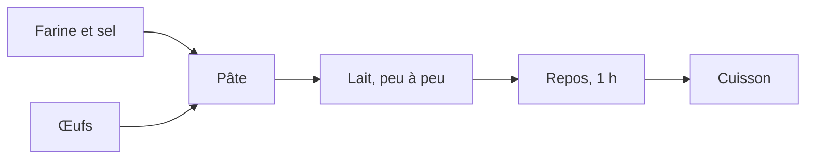

# Formatage en Markdown, et comparaison de versions — TD 3a, cours 1

Le dossier sert à deux TD : la mise en forme d'un texte brut en
Markdown, à la partie 3, et la comparaison de deux versions d'un même fichier,
gardée en annexe et jouée si l'horaire le permet.

| Fichier | Rôle |
|---|---|
| `recette_a_formater.txt` | le texte de départ, sans aucune structure |
| `ingredients.csv` | les ingrédients, à transformer en tableau |
| `recette.md` | le résultat attendu — à n'ouvrir qu'après avoir essayé |
| `comparer.py` | compare deux versions d'un fichier texte, et applique le résultat ailleurs |

Les fichiers que les étudiants produisent ici — `recette_v2.md`,
`recette_v3.md`, `modifs.diff`, les `.odt` de conversion — sont dans
`.gitignore` : ils naissent à côté de leur source parce que c'est la commande
que les étudiants tapent, comme l'exécutable du « hello world ».

## Ce que le TD fait travailler

Le texte de départ n'a **aucune structure** : ni titre, ni liste, ni tableau.
C'est voulu. L'exercice n'est pas de recopier des marques, c'est de décider ce
qui est un titre, ce qui est une étape et ce qui est une donnée — la mise en
forme est une lecture du contenu.

1. Ouvrir le dossier dans l'éditeur, puis `recette_a_formater.txt`.
2. L'enregistrer sous `recette.md`, et ouvrir l'aperçu côte à côte :
   `Ctrl` + `K` puis `V`.
3. Un titre en `#`, deux sous-titres en `##`.
4. Les étapes de préparation en liste numérotée.
5. Les ingrédients en tableau, depuis `ingredients.csv`.
6. L'ordre des opérations en bloc `mermaid`.

## Le tableau depuis le CSV

Il se tape à la main la première fois — l'intérêt est de constater qu'un
tableau Markdown n'est que des barres verticales, et que leur alignement n'est
même pas obligatoire. Une extension du catalogue le fait ensuite en une
commande ; chercher « CSV to Markdown Table » dans le panneau Extensions.
Plusieurs existent et se valent, aucune n'est indispensable.

## Le diagramme

Rien à installer : depuis la version 1.121, VSCode rend les diagrammes Mermaid
dans l'aperçu Markdown d'origine, par l'extension `mermaid-markdown-features`
livrée avec l'éditeur.



Le dessin n'est pas dans le fichier : le `.md` ne contient que ces six lignes,
et les boîtes sont calculées à l'affichage — comme la coloration l'était pour
le code.

## Pour aller plus loin

Ajouter une photo par ``, ce qui fait retravailler les
chemins relatifs de la partie 1, et la remarque finale en citation par `>`.

## La comparaison de deux versions

TD d'annexe, qui prépare le cours 2. Le point de départ est un geste
déjà fait à la partie 3 : modifier un fichier sous un autre nom.

### Déroulé

1. Ouvrir `recette.md`, puis **Fichier → Enregistrer sous**, sous le nom
   `recette_v2.md`. Dans cette copie, faire passer le repos à deux heures et le
   lait à 600 ml. Imposer ces deux corrections à toute la salle : les sorties
   qui suivent sont chiffrées et ne correspondront pas si chacun modifie ce
   qu'il veut.
2. Clic droit sur `recette.md`, **Sélectionner pour comparer** ; puis clic droit
   sur `recette_v2.md`, **Comparer avec l'élément sélectionné**. Deux lignes
   sont signalées, les trente-trois autres sont identiques.
3. Faire faire la même comparaison par un programme :

   ```console
   $ python comparer.py creer recette.md recette_v2.md modifs.diff
   modifs.diff : 19 lignes, dont 4 de différence
   ```

4. Ouvrir `modifs.diff` dans l'éditeur, et en lire l'en-tête :

   ```
   --- recette.md
   +++ recette_v2.md
   @@ -1,6 +1,6 @@
    # Crêpes

   -*Pour 12 crêpes — 10 minutes de préparation, 1 heure de repos.*
   +*Pour 12 crêpes — 10 minutes de préparation, 2 heures de repos.*
   ```

5. Reconstruire la seconde version à partir de la première et du fichier de
   différences, sous un troisième nom :

   ```console
   $ python comparer.py appliquer recette.md modifs.diff recette_v3.md
   recette_v3.md : 35 lignes, reconstruites à partir de recette.md
   ```

6. Comparer `recette_v3.md` et `recette_v2.md` dans l'éditeur : aucune
   différence. 370 octets ont suffi à refaire un fichier de 741.

### Le cas du binaire

```console
$ pandoc recette.md -o recette.odt
$ pandoc recette_v2.md -o recette_v2.odt
$ python comparer.py creer recette.odt recette_v2.odt modifs.diff
recette.odt n'est pas un fichier texte : ses octets ne se lisent pas comme des
caractères. D'un fichier binaire, une comparaison ne peut dire que s'il diffère
d'un autre, pas ce qui y a changé.
```

Les deux `.odt` font 8 195 octets chacun, et 1 690 de ces octets diffèrent, pour
deux mots changés : le contenu y est compressé, donc redistribué en entier. Rien
n'y est lisible ligne à ligne. C'est la réponse complète à « pourquoi un `.odt`
se versionne mal », posée en première partie.

### Ce que le TD prépare

Comparer deux versions et transmettre leur différence sont deux des gestes que
git automatise. Ce qui manque encore, et qui est le sujet du cours 2 :
l'historique, les auteurs, et le fait de n'avoir plus à inventer un nom de
fichier par version.

### Ce qui a été mesuré

Relevé sur la machine de préparation, avec Python 3.12.14 et pandoc 3.11.

| Mesure | Valeur |
|---|---|
| `recette.md` | 741 octets, 35 lignes |
| `recette_v2.md` | 742 octets |
| `modifs.diff` | 370 octets, 19 lignes, dont 4 de contenu |
| `recette.odt` et `recette_v2.odt` | 8 195 octets chacun, 1 690 octets différents |

`comparer.py` n'emploie que `difflib`, de la bibliothèque standard : rien à
installer, et le TD tourne dans n'importe quel environnement Python.
