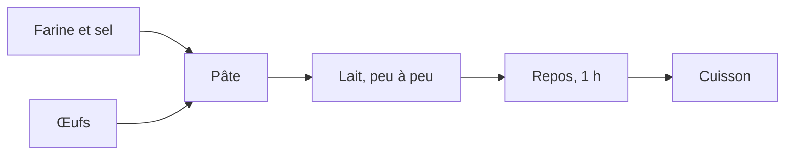

# Crêpes

*Pour 12 crêpes — 10 minutes de préparation, 1 heure de repos.*

## Ingrédients

| Ingrédient | Quantité |
|---|---|
| Farine | 250 g |
| Œufs | 4 |
| Lait | 500 ml |
| Sel | 1 pincée |
| Beurre fondu | 50 g |

## Préparation

1. Mélanger la farine et le sel dans un saladier.
2. Casser les œufs au centre et mélanger.
3. Verser le lait **peu à peu**, sans cesser de remuer.
4. Ajouter le beurre fondu.
5. Laisser reposer une heure.
6. Cuire dans une poêle chaude, une minute par face.

## L'ordre des opérations

> La pâte se conserve 24 heures au réfrigérateur.
