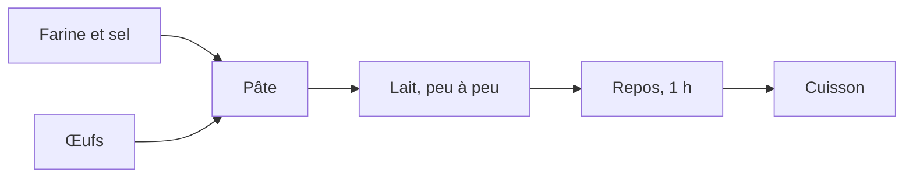

# Formatage en Markdown — Cours 1

Trois fichiers courts, versionnés : ce sont des sources de quelques lignes, pas
des données dérivées.

| Fichier | Rôle |
|---|---|
| `recette_a_formater.txt` | le texte de départ, sans aucune structure |
| `ingredients.csv` | les ingrédients, à transformer en tableau |
| `recette.md` | le résultat attendu — à n'ouvrir qu'après avoir essayé |

## Ce que la manipulation fait travailler

Le texte de départ n'a **aucune structure** : ni titre, ni liste, ni tableau.
C'est voulu. L'exercice n'est pas de recopier des marques, c'est de décider ce
qui est un titre, ce qui est une étape et ce qui est une donnée — la mise en
forme est une lecture du contenu.

1. Ouvrir le dossier dans l'éditeur, puis `recette_a_formater.txt`.
2. L'enregistrer sous `recette.md`, et ouvrir l'aperçu côte à côte :
   `Ctrl` + `K` puis `V`.
3. Un titre en `#`, deux sous-titres en `##`.
4. Les étapes de préparation en liste numérotée.
5. Les ingrédients en tableau, depuis `ingredients.csv`.
6. L'ordre des opérations en bloc `mermaid`.

## Le tableau depuis le CSV

Il se tape à la main la première fois — l'intérêt est de constater qu'un
tableau Markdown n'est que des barres verticales, et que leur alignement n'est
même pas obligatoire. Une extension du catalogue le fait ensuite en une
commande ; chercher « CSV to Markdown Table » dans le panneau Extensions.
Plusieurs existent et se valent, aucune n'est indispensable.

## Le diagramme

Rien à installer : depuis la version 1.121, VSCode rend les diagrammes Mermaid
dans l'aperçu Markdown d'origine, par l'extension `mermaid-markdown-features`
livrée avec l'éditeur.

Le dessin n'est pas dans le fichier : le `.md` ne contient que ces six lignes,
et les boîtes sont calculées à l'affichage — comme la coloration l'était pour
le code.

## Pour aller plus loin

Ajouter une photo par ``, ce qui fait retravailler les
chemins relatifs de la partie 1, et la remarque finale en citation par `>`.
