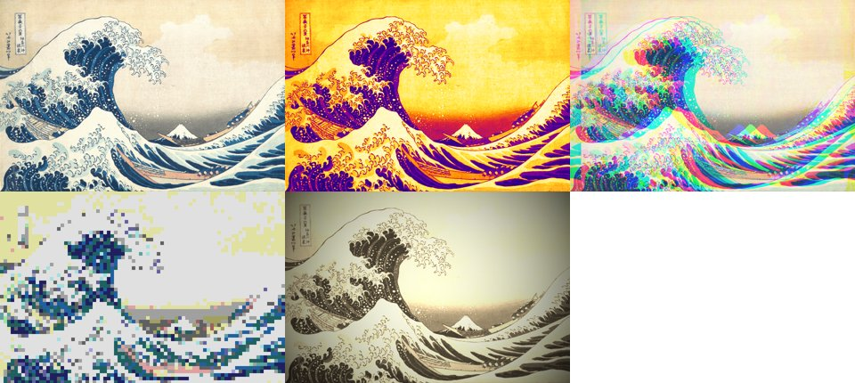

# Projet 7 — Un effet pour l'animation (document de conception)

> Premier jet, 24/09/2026. Séance du 03/11/2026. Vue d'ensemble : [syllabus v1.5](../../03_syllabus_v1_5.md). Remplace le benchmark de conversion en gris du [syllabus v1](../../01_syllabus_v1.md) (dossier `7_projet_benchmark_image/`, resté vide).

## Objectif

Ajouter une fonctionnalité au programme du projet 4 par une pull request : une option `--effet`, qui applique un effet à chaque image de la série avant la création de la vidéo. L'effet est écrit deux fois, en boucle sur les pixels puis avec numpy ; les deux versions sont comparées (même résultat, temps d'exécution).

Ce que la séance fait pratiquer :

| Compétence | Vue | Ici |
|---|---|---|
| Installer un paquet dans un environnement | cours 3 (TD 0a) ou projet 4 | numpy et Pillow dans `animation`, et dans `environment.yml` |
| Branche, commit, `merge` | cours 2, projet 4 | une branche `effet` |
| `push`, pull request | cours 6 | la pull request de la branche `effet`, relue par un camarade |
| `argparse` | cours 3, projet 4 | l'option `--effet` et ses choix |
| Lire et écrire des fichiers | cours 3 | les images de la série, lues en tableaux puis réécrites |
| README en Markdown | cours 2 (v1), projet 4 | `RAPPORT.md` |

## Au début de la séance

- Le dépôt du projet 4 (montre ou tourbillon), publié sur GitHub au cours 6, cloné sur le poste.
- L'environnement `animation` du projet 4 (`conda env create -f environment.yml` s'il n'est plus sur le poste).
- La clé SSH du cours 5, enregistrée sur le compte GitHub.
- Pour qui n'a pas de projet 4 terminé : le dépôt de référence du cours 6, construit depuis `data/cours4/corriges/<td>/` (programme de `b3/`, README de `b4/`).

## Déroulé (≈ 120′)

| Durée | Partie | Contenu |
|---|---|---|
| 🎓 10′ | Présentation | une image est un tableau de nombres : `shape` (480, 640, 3), `dtype` uint8 (un octet par valeur, lien avec le cours 3) ; les quatre effets (planche ci-dessous) ; boucle sur les pixels et opération sur le tableau entier |
| ⌨️ 10′ | Préparer | `git pull` ; branche `effet` ; `conda install -c conda-forge numpy pillow` dans `animation` ; les ajouter à `environment.yml` ; commit |
| ⌨️ 10′ | Lire et écrire une image | coller les fonctions `lire`, `ecrire` et `appliquer` (fournies) ; lire une image de la série, afficher `shape` et `dtype` |
| ⌨️ 35′ | L'effet, deux fois | choisir un effet ; écrire `<effet>_boucle`, puis `<effet>_numpy` ; le test d'égalité sur une petite image ; un commit par version |
| ⌨️ 15′ | L'option `--effet` | l'option dans `argparse` ; `appliquer` appelé entre la série et la vidéo ; la vidéo avec l'effet ; commit |
| ⌨️ 10′ | Mesurer et `RAPPORT.md` | chronométrer les deux versions ; le tableau des temps ; commit |
| ⌨️ 20′ | Pull request et revue | `push` ; ouvrir la pull request ; ajouter un camarade comme collaborateur et lui demander une revue ; relire la sienne ; fusionner |
| 10′ | Mise en commun | quelques vidéos projetées ; les rapports de temps obtenus par effet |

## Les quatre effets



*De gauche à droite, puis de haut en bas : l'original, caméra thermique, glitch, pixel art, vieux film.*

| Effet | Calcul pour le pixel (y, x) | Version numpy | Difficulté |
|---|---|---|---|
| Caméra thermique | `gris = (299 r + 587 v + 114 b) // 1000`, puis la couleur `TABLE[gris]` (table de 256 couleurs fournie) | `TABLE[gris]`, avec `gris` calculé sur les trois canaux du tableau | la plus simple |
| Glitch | rouge lu en `x - k`, vert en `x`, bleu en `x + k` (modulo la largeur) ; `k` dépend du numéro de l'image | `np.roll` sur le canal rouge et sur le canal bleu | simple |
| Pixel art | la couleur du premier pixel du bloc `N × N` qui contient (y, x), soit `(y - y % N, x - x % N)` ; chaque valeur ramenée à `v // 64 * 64 + 32` | tranches `[::N, ::N]`, puis `np.repeat` sur les deux axes | moyenne |
| Vieux film | sépia : chaque canal est une combinaison des trois, plafonnée à 255 ; puis multiplié par `1000 - 700 d² // d²max`, divisé par 1000, où `d²` est le carré de la distance au centre (Pythagore, sans racine) | les mêmes opérations sur les canaux entiers ; `np.ogrid` pour les coordonnées | la plus longue |

Tous les calculs sont en entiers : la version boucle et la version numpy donnent alors exactement les mêmes octets, et le test `np.array_equal` est possible. Implémentation de référence : [`effets_reference.py`](effets_reference.py).

Chaque fonction d'effet a la même forme : elle prend l'image (tableau numpy) et le numéro de l'image dans la série, et renvoie une nouvelle image de même forme. Le numéro ne sert qu'au glitch.

## Le code ajouté au programme du projet 4

Fourni tel quel dans le guide (la « plomberie »), testé le 24/09 sur des images PNG 640 × 480 :

```python
import numpy as np
from PIL import Image


def lire(fichier):
    """L'image du fichier, en tableau numpy (hauteur, largeur, 3) d'entiers de 0 à 255."""
    return np.asarray(Image.open(fichier).convert("RGB"))


def ecrire(tableau, fichier):
    """Enregistre le tableau comme image ; le format suit l'extension du fichier."""
    Image.fromarray(tableau).save(fichier)


def appliquer(effet):
    """Applique l'effet à chaque image de la série, en remplaçant le fichier ; renvoie le nombre d'images."""
    fichiers = sorted(IMAGES.glob("img_*.png"))
    for numero, fichier in enumerate(fichiers, start=1):
        ecrire(effet(lire(fichier), numero), fichier)
    return len(fichiers)
```

À écrire par l'élève :

- les deux fonctions de son effet ;
- `EFFETS = {"thermique": thermique_numpy}` (le nom de l'option et la fonction appelée) ;
- dans `main`, l'option : `analyseur.add_argument("--effet", choices=sorted(EFFETS), help="…")` ;
- dans `main`, entre `serie(...)` et `assembler(...)` : `if options.effet: appliquer(EFFETS[options.effet])`.

Les deux programmes du projet 4 (`montre.py`, `tourbillon.py`) écrivent leur série dans `sortie/images/img_0001.png`, `img_0002.png`… : `appliquer` sert pour les deux sans modification.

## Vérifier : le test d'égalité

Un fichier `test_effet.py` à côté du programme, écrit par l'élève à partir d'un modèle :

```python
import numpy as np
from tourbillon import thermique_boucle, thermique_numpy   # ou montre

image = np.random.default_rng(0).integers(0, 256, size=(48, 64, 3), dtype=np.uint8)
print(np.array_equal(thermique_boucle(image, 3), thermique_numpy(image, 3)))
```

`python test_effet.py` doit afficher `True`. L'import fonctionne parce que `main()` n'est appelé que sous `if __name__ == "__main__":` (cours 3). Ce test remplace l'autograder de GitHub Classroom prévu dans le v1.

## Mesurer

Temps pour une image 640 × 480, sur la machine de préparation (AMD Ryzen 5 1600X, Python 3.12.14, numpy 2.5.2), le 24/09 :

| Effet | Boucle | numpy | Rapport |
|---|---|---|---|
| Caméra thermique | 0,39 s | 6,0 ms | ≈ 60 |
| Glitch | 0,25 s | 0,5 ms | ≈ 500 |
| Pixel art | 0,39 s | 0,8 ms | ≈ 500 |
| Vieux film | 0,62 s | 14,5 ms | ≈ 40 |

Sur une série : 49 images pour le tourbillon (0 à 360° puis retour, de 15 en 15), 120 pour la montre avec `--minutes 120`. La boucle prend alors de 12 s (glitch, tourbillon) à 75 s (vieux film, montre) ; numpy moins d'une seconde dans tous les cas. Chronométrer la boucle sur une image et numpy sur la série suffit si le temps manque.

Chronométrage : `time.perf_counter()` avant et après l'appel, comme dans `mesures.py` du cours 5.

## Pull request et revue

- La branche `effet` est poussée ; la pull request vers `master` a pour titre l'effet choisi, et pour description le tableau des temps.
- Le camarade relecteur a choisi un autre effet. Il est ajouté comme collaborateur du dépôt (Settings → Collaborators) et désigné comme relecteur.
- Il vérifie trois choses et laisse un commentaire : la commande du README fonctionne ; `python test_effet.py` affiche `True` ; le tableau du rapport donne les deux temps.
- L'auteur fusionne la pull request sur le site, puis `git pull` sur `master` en local.

## `RAPPORT.md`

Gabarit fourni :

```markdown
# Effet : <nom>

 

| Version | Une image | La série (<n> images) |
|---|---|---|
| boucle | | |
| numpy | | |

<Une phrase : combien de fois numpy est plus rapide, et pourquoi.>
```

## Facultatif

- Appliquer deux effets à la suite (`--effet` répété : `action="append"` dans `argparse`).
- Pour le TD de la montre : l'incrustation sur une photo choisie par l'élève, à la place du fond blanc (le fond de la Vague n'est pas uni, l'effet ne s'y applique pas).
- Repris des § 5 et 6 d'`images.ipynb` du cours 3 : taille d'une image non compressée (hauteur × largeur × 3 octets) comparée à celle des fichiers PNG ; taille du dossier `sortie/images/` comparée à celle de la vidéo ; temps de lecture de la série en PNG et en `.npy` (`np.save`, `np.load`).

## Le guide

Même forme que les guides du projet 4 (`src/cours4/notebook/td/<td>/guide.md`), un seul guide pour les deux TD. Pour chaque étape : l'objectif et la commande de vérification. Le code n'est donné que pour la plomberie, la table thermique et le modèle du test ; pour les effets, le guide donne le calcul par pixel et le nom des fonctions numpy utiles, pas le code.

## Reste à faire

1. Mesurer les temps sur un poste de la salle, sur les deux séries du projet 4.
2. Vérifier que `numpy` et `pillow` s'installent dans `animation` sans conflit avec `imagemagick` et `ffmpeg` (conda-forge).
3. Construire les dépôts de référence (montre, tourbillon) pour le cours 6 et pour cette séance.
4. Écrire le guide (`src/cours7/notebook/td/7a_effets/guide.md`) et les diapositives de présentation (`src/cours7/diapo/`).
5. Écrire le corrigé : un programme par TD avec les quatre effets, à partir d'`effets_reference.py`.
